# ColorfulCoherence

This is an extension of [Colorful Image Colorization by Zhang et al.](http://richzhang.github.io/colorization/). It is the final project for the Gothenburg University Machine Learning Course.

We attempt to create spatially coherent colorizations that do not compromise
on color saturation.

Feel free to read the [report](Report.pdf) if you would like to learn more about the ideas behind the implementation.

# Setup

To run it on the university project server, first clone the project.

Then download the pretrained [`model.h5` from here](https://drive.google.com/drive/folders/1lAufAw_OPL7fOj7OqS_HxsWkamvIwyPP?usp=sharing).

Place it in a new folder called `model` within the project.

Now you should be able to just run these commands to train and test:

```
python3.6 -m src.remote_runner
python3.6 -m src.remote_validator
```

# Results

You can find more information about these results in the [report](Report.pdf).

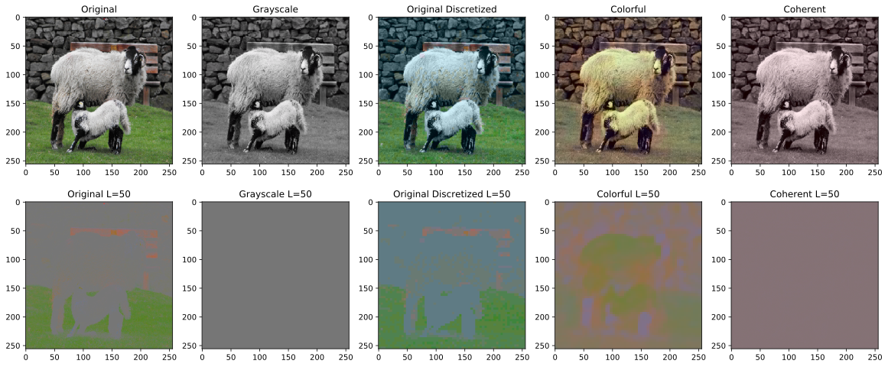
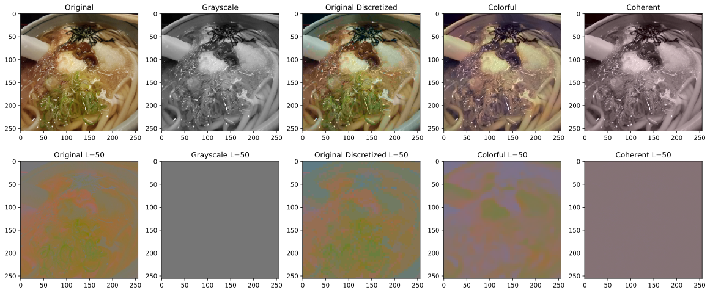
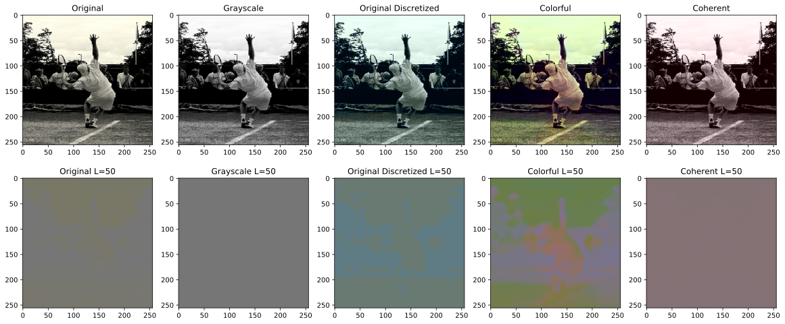
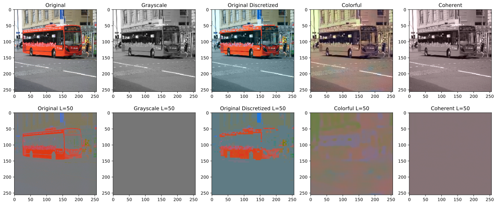
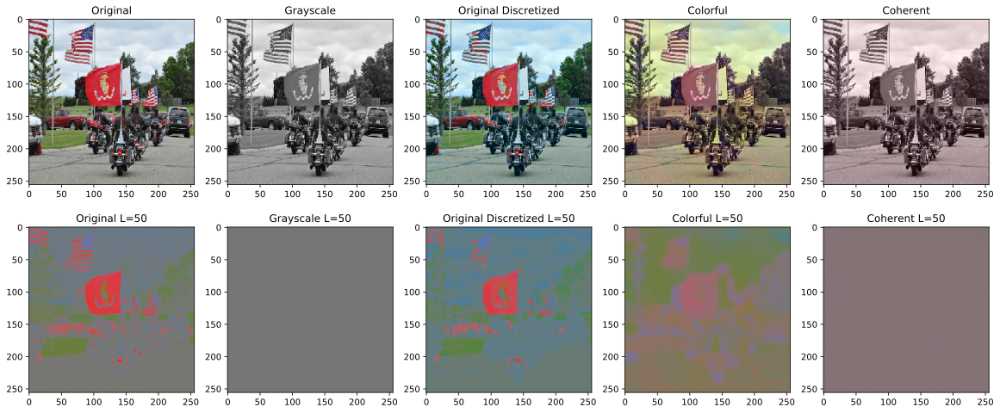
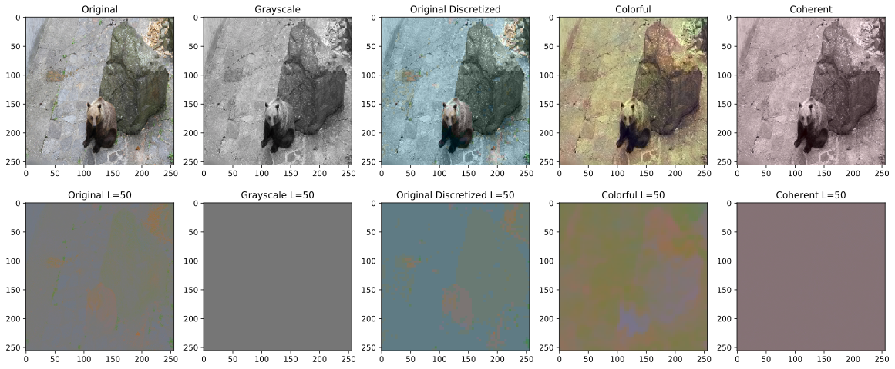
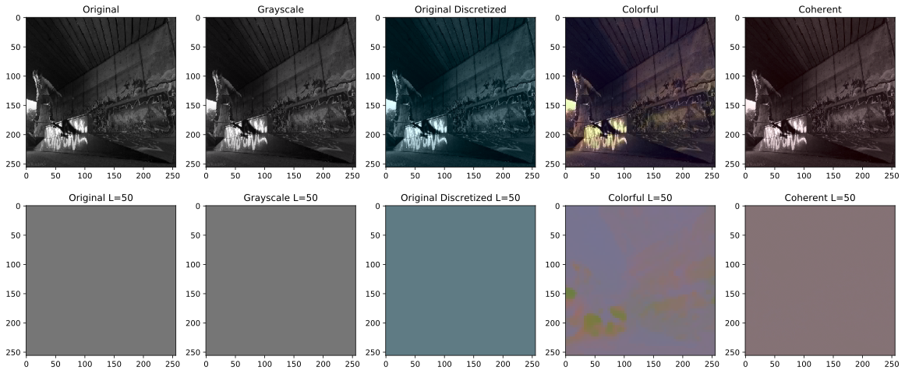
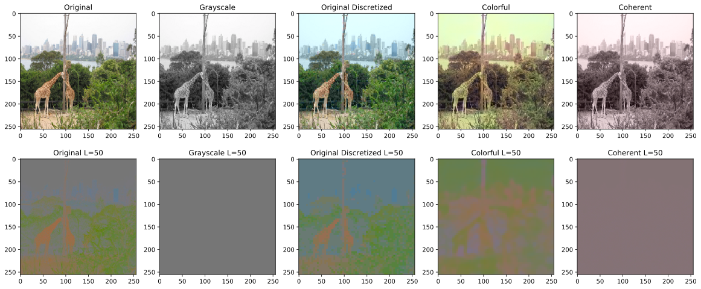
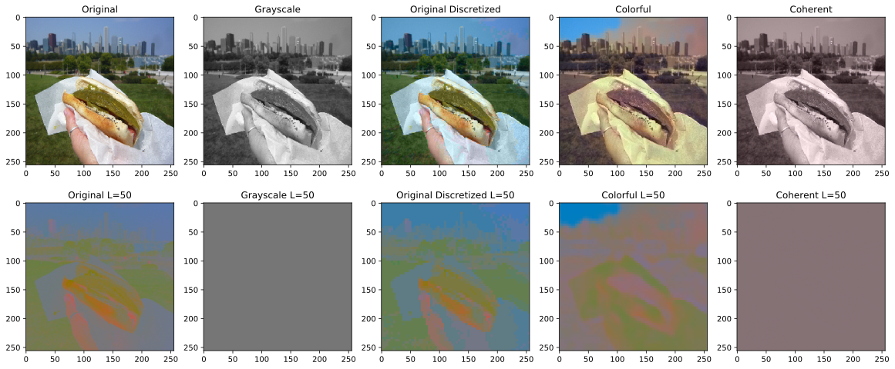
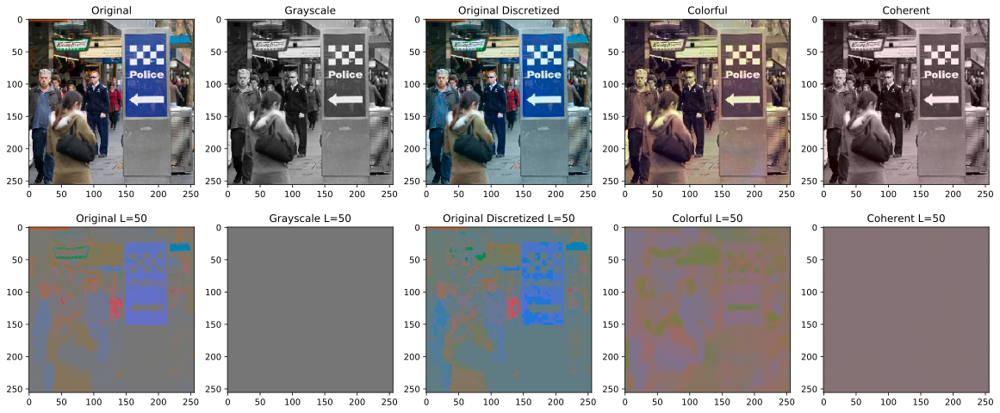
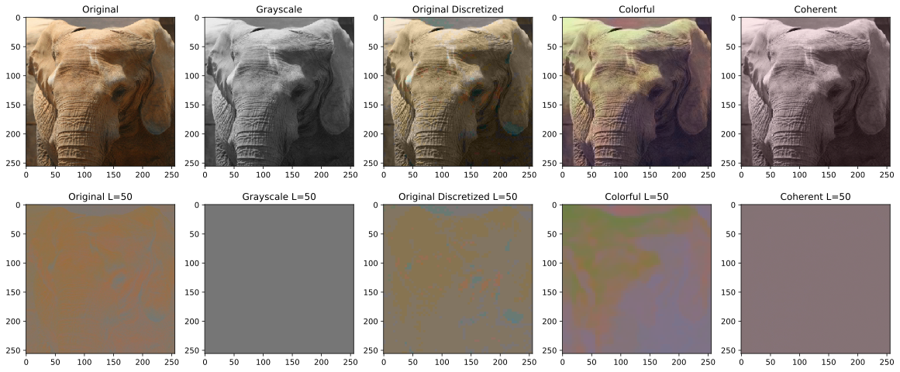
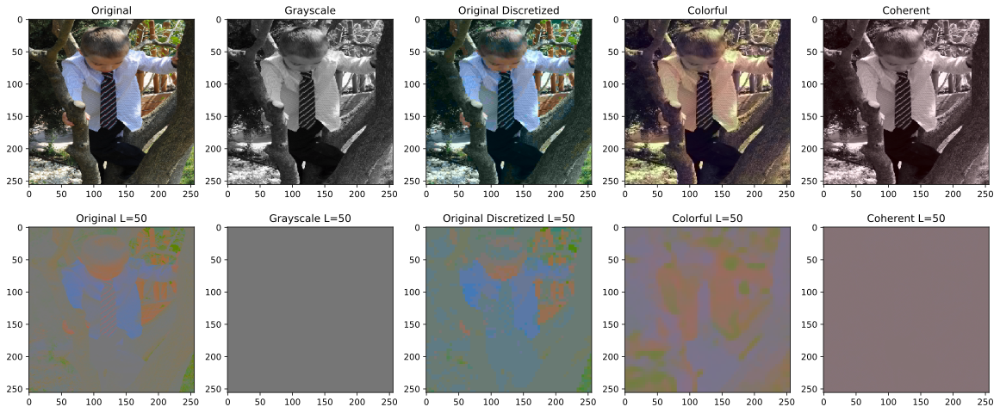
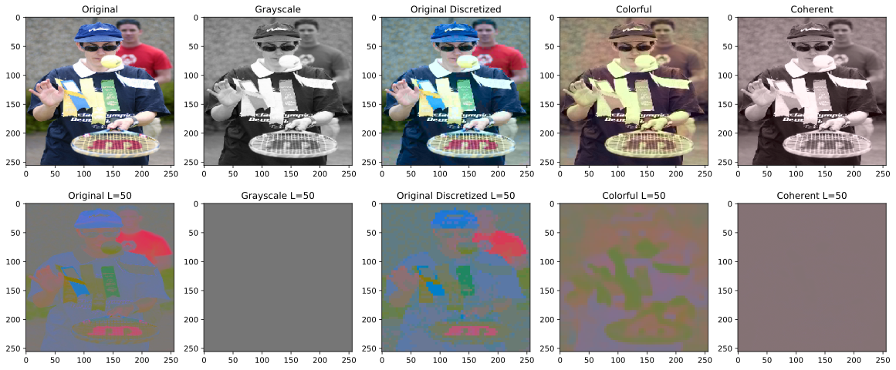
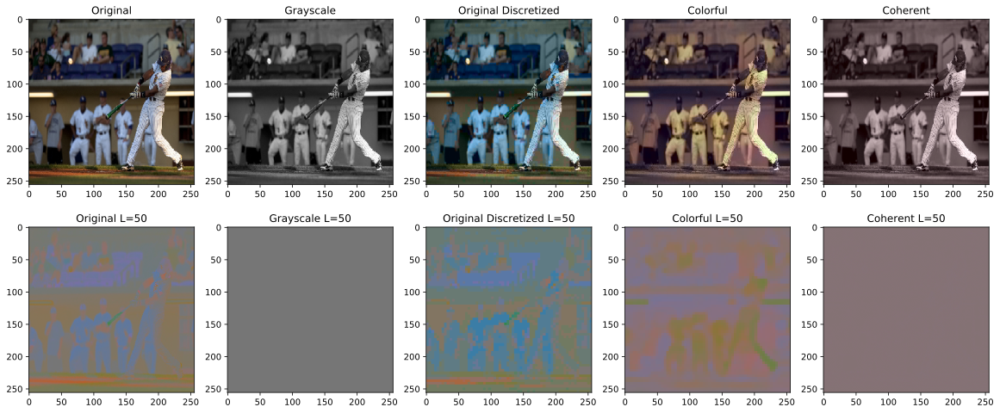
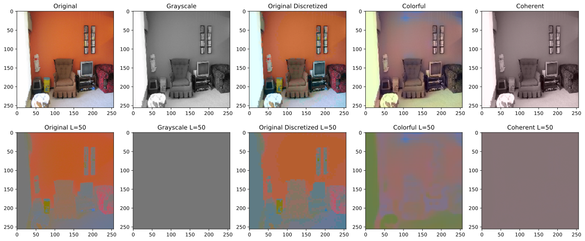
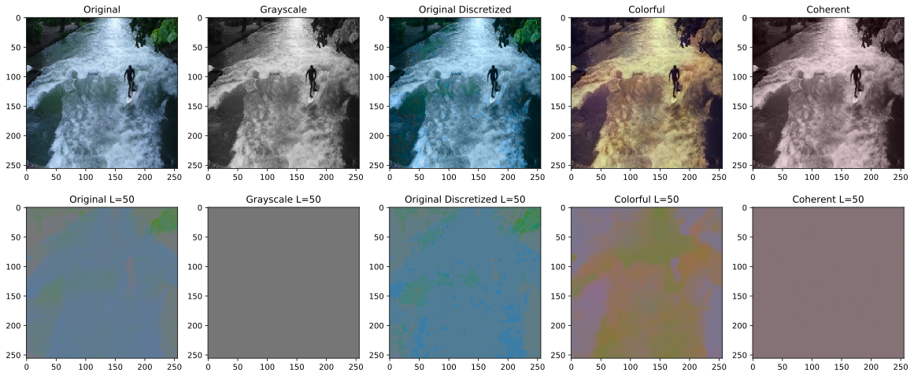
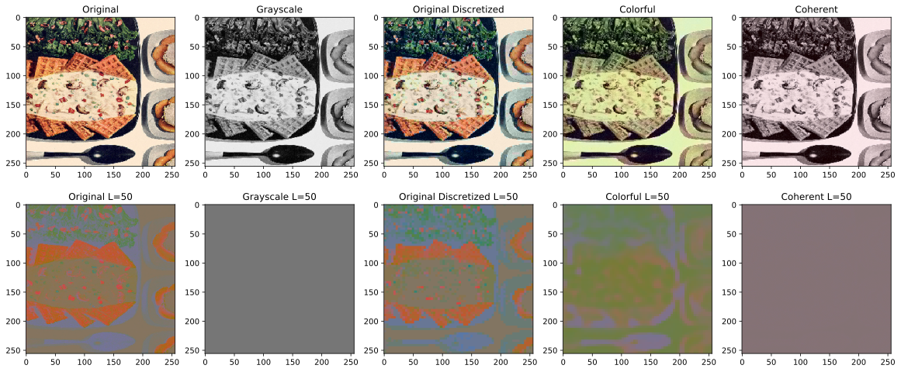
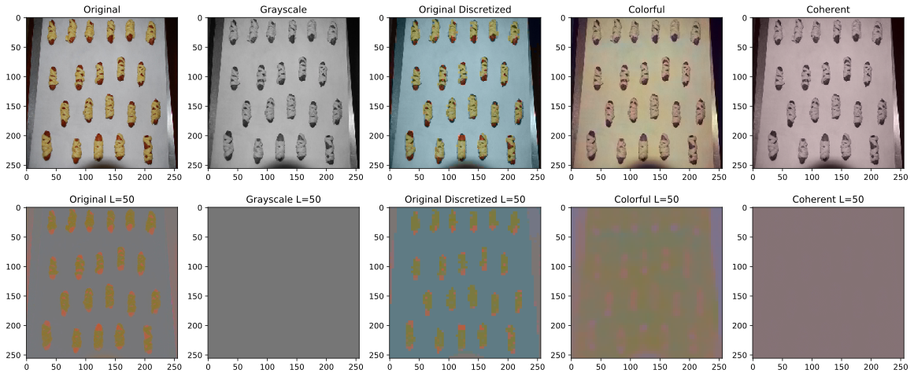
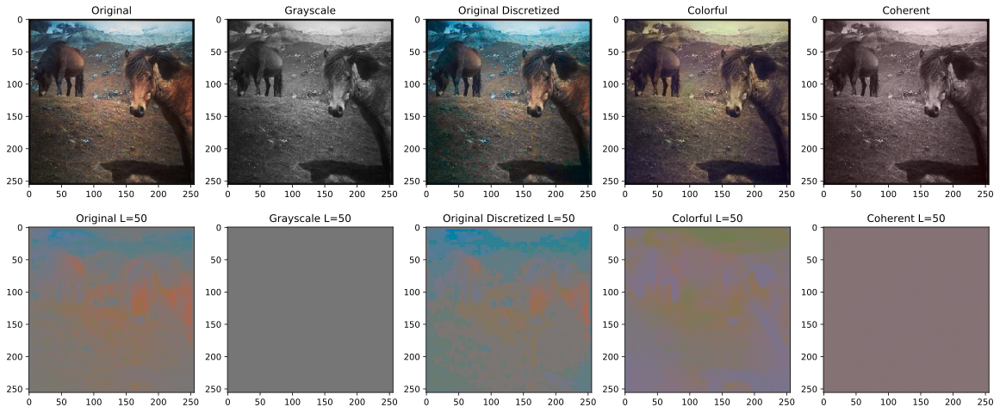
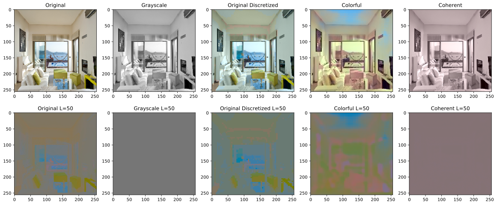
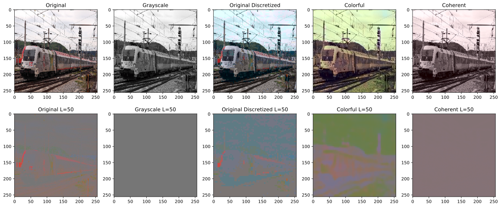
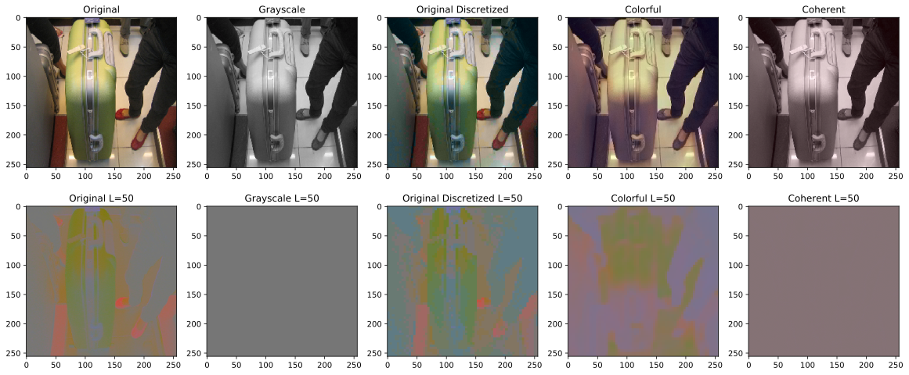

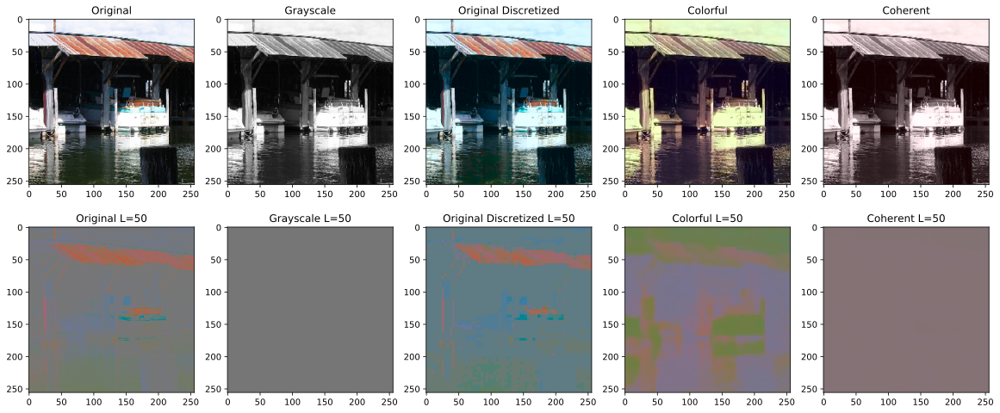
